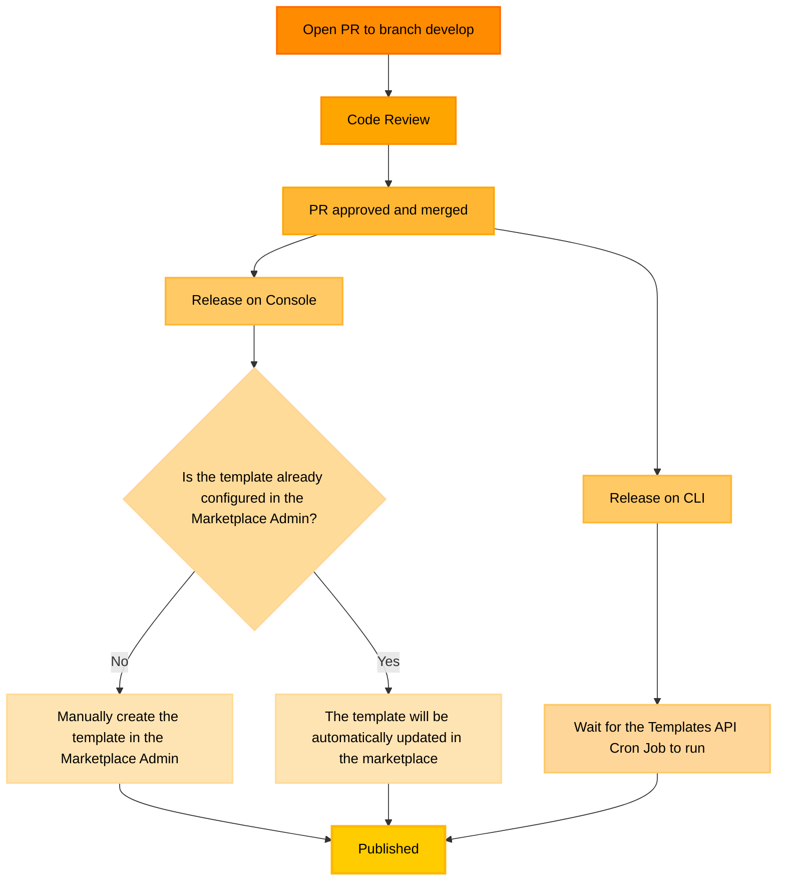

# Release Workflow Diagram

```mermaid
graph TD
    A[Open PR to branch develop]
    A --> B[Code Review]
    B --> C[PR approved and merged]
    C --> D[Release on CLI]
    C --> E[Release on Console]
    D --> D1[Wait for the Templates API Cron Job to run]
    E --> E1{Is the template already configured in the Marketplace Admin?}
    E1-->|No| E2[Manually create the template in the Marketplace Admin]
    E1 -->|Yes| E3[The template will be automatically updated in the marketplace]
    E2 --> F
    E3 --> F
    D1 --> F
    F[Published]
    
    classDef startNode fill:#FF8C00,stroke:#FF6B00,stroke-width:2px,color:#000
    classDef reviewNode fill:#FFA500,stroke:#FF8C00,stroke-width:2px,color:#000
    classDef approvedNode fill:#FFB733,stroke:#FFA500,stroke-width:2px,color:#000
    classDef releaseNode fill:#FFC966,stroke:#FFB733,stroke-width:2px,color:#000
    classDef waitNode fill:#FFD699,stroke:#FFC966,stroke-width:2px,color:#000
    classDef decisionNode fill:#FFDB99,stroke:#FFD699,stroke-width:2px,color:#000
    classDef actionNode fill:#FFE4B3,stroke:#FFDB99,stroke-width:2px,color:#000
    classDef publishNode fill:#FFCC00,stroke:#FFB700,stroke-width:3px,color:#000
    
    class A startNode
    class B reviewNode
    class C approvedNode
    class D,E releaseNode
    class D1 waitNode
    class E1 decisionNode
    class E2,E3 actionNode
    class F publishNode
```

## Notes

- The Templates API Cron Job is scheduled to run every hour, but you can manually run the job to update the template list instantly.