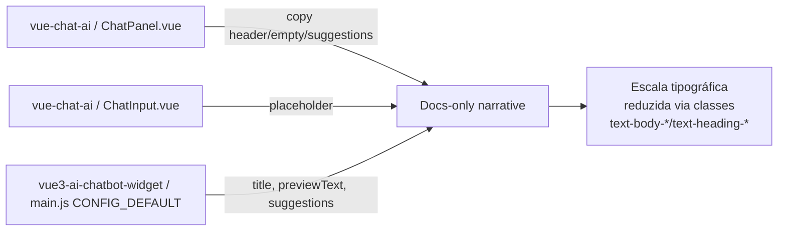

# Design: Chat Docs-Only Narrative + Compact Typography

> Status: **Draft, awaiting approval**
> Linked requirements: `specs/chat-docs-only-narrative/requirements.md`

## 1. Goals & Non-Goals

**Goals**

- Reescrever a copy visível de ambos os templates de chat (`vue-chat-ai`
  e `vue3-ai-chatbot-widget`) para deixar explícito que o assistente
  responde apenas dúvidas sobre a documentação Azion.
- Reduzir a escala tipográfica global do chat via tokens/CSS, sem
  overrides pontuais.
- Manter a11y (font ≥ 12px, contraste AA, zoom operável) e hierarquia
  visual pós-redução.

**Non-Goals**

- Alterar system prompt, backend ou lógica de recusa server-side.
- Redesign de cores, spacing, layout ou ícones.
- Tocar `templates/react/tanstack-chat-ai` (sendo removido).
- Introduzir i18n onde não existe.

## 2. High-Level Architecture

Ambos os templates são apps Vue standalone. `vue-chat-ai` é um app Nuxt
que consome `@aziontech/webkit` + `@aziontech/theme` (tokens em
`var(--*)`, classes `text-body-*` / `text-heading-*`). O
`vue3-ai-chatbot-widget` é um Vite/Vue3 puro com PrimeVue + `azion-theme`
via SCSS/CSS clássico, config default vinda de env em `src/main.js`.

Nenhum backend é alterado. Toda mudança fica em: (a) strings de copy nos
componentes / config defaults, (b) tokens de tipografia ou classes de
texto aplicadas nesses componentes. O comportamento de fluxo de mensagens
e streaming não muda.

## 3. Components

### 3.1 `vue-chat-ai / ChatPanel.vue`

- **Purpose**: Empty state, header e suggestions do chat principal.
- **Type**: Vue SFC (setup).
- **Inputs / Outputs**: usa `useSettings`, emite navegação de conversa.
- **Responsibilities**:
  - Trocar `<h1>` do empty state (linha 149–151, hoje "No que você está pensando hoje?") por copy docs-only.
  - Adicionar subtítulo/lead abaixo do `<h1>` explicando o escopo em uma linha.
  - Substituir constante `SUGGESTIONS` (linhas 22–27) por 4 exemplos ancorados em documentação Azion (Edge Applications, Edge Functions, WAF, Cache Rules — decisão em §7.1).
  - Trocar rótulos "All Azion Platform" (linhas 158, 323) por rótulo docs-only (ex.: "Azion Docs").
  - Ajustar `providerLabel` para prefixar `Docs Assistant · <provider>` no header do active state (linha 239).
- **Non-responsibilities**: não altera lógica de streaming, `useChat`, ou histórico.
- **Touches requirements**: 1.1, 1.2, 1.4, 2.1, 2.2

### 3.2 `vue-chat-ai / ChatInput.vue`

- **Purpose**: Input de mensagem.
- **Type**: Vue SFC.
- **Responsibilities**:
  - Trocar placeholder default (linhas 155–161, hoje "Plan, Build, / for skills, @ for context") por "Pergunte sobre a documentação da Azion…".
  - Ajustar disabled/loading placeholders para copy consistente.
  - Se necessário, reduzir a classe do `<textarea>` de `text-body-md` para `text-body-sm` (decisão em §7.2).
- **Non-responsibilities**: não muda submit, gravação, anexos.
- **Touches requirements**: 1.3, 1.4, 2.1

### 3.3 `vue-chat-ai / MessageList.vue`

- **Purpose**: Lista de mensagens do chat.
- **Type**: Vue SFC.
- **Responsibilities**: aplicar redução de escala tipográfica nas mensagens (linhas com `text-body-md` e `text-body-xs`) alinhado ao §7.2 — sem hard-coded font-size.
- **Touches requirements**: 2.1, 2.2, 2.4, 2.5, 3.1, 3.3

### 3.4 `vue-chat-ai / assets/styles/app.css`

- **Purpose**: Estilos globais do template.
- **Responsibilities**:
  - Aplicar override de tipografia base via `:root { font-size: 14px }` (base do webkit é 16px) para escalar todas as classes `text-body-*`/`text-heading-*` (que usam `rem`) proporcionalmente.
  - Alternativa (§7.2) se preferido: override individual das classes de tipografia via CSS. Ver decisão.
- **Touches requirements**: 2.1, 2.2, 2.3, 2.4, 2.5, 3.1, 3.3

### 3.5 `vue3-ai-chatbot-widget / src/main.js`

- **Purpose**: Config defaults do widget.
- **Type**: JS module.
- **Responsibilities**:
  - Ajustar defaults `title`, `subTitle`, `previewText`, `footerDisclaimer`, `suggestionsOptions` para copy docs-only.
  - `title` default: `'Azion Docs Assistant'`. `subTitle`: `'Answers based on Azion documentation'`. `previewText`: `'Ask about Azion docs…'`. Suggestions ancoradas em docs (§7.1).
  - Env vars (`VITE_TITLE`, etc.) permanecem — só o fallback muda (1.5).
- **Non-responsibilities**: não altera auth, PrimeVue, mount.
- **Touches requirements**: 1.1, 1.2, 1.3, 1.4, 1.5

### 3.6 `vue3-ai-chatbot-widget / src/components/welcome.vue` e `layout-chat/chat-header.vue`

- **Purpose**: Header e welcome do widget.
- **Responsibilities**:
  - Fallback do `title` no header (`chat-header.vue:6`, hoje `'Copilot'`) passa a `'Azion Docs Assistant'`.
  - Fallback do disclaimer no footer (`chat-footer.vue:70`) passa a menção de "documentação Azion".
  - Welcome: aceita subtítulo e mostra o texto docs-only quando `title` está setado.
- **Touches requirements**: 1.1, 1.2, 1.4, 1.5

### 3.7 `vue3-ai-chatbot-widget / src/assets/main.css` (ou equivalente)

- **Purpose**: Estilos globais do widget.
- **Responsibilities**: mesma estratégia de §3.4 aplicada ao root do widget (`:root { font-size: 14px }`) — respeitando §7.3 (widget embedável).
- **Touches requirements**: 2.1, 2.2, 2.3, 2.5, 3.1, 3.2, 3.3

## 4. Data Model

Não aplicável.

## 5. APIs / Contracts

Não aplicável — nenhum contrato de rede ou de biblioteca externa muda.
As props e slots dos componentes preservam assinatura (1.5).

## 6. Cross-Cutting Concerns

### 6.1 Security

Sem superfície nova. Reforço: o disclaimer visual sobre "só documentação"
**não** é enforcement — é orientação de UX. Guardrail server-side fica
explicitamente fora de escopo.

### 6.2 Performance & scalability

Alteração puramente de copy + tokens CSS. Zero impacto em runtime.
Bundle size praticamente idêntico (algumas strings a mais/menos).

### 6.3 Observability

Nada a instrumentar. Se algum template já emite analytics de suggestion
click, os IDs de suggestion devem refletir as novas strings.

### 6.4 Accessibility

- Font base do body ≥ 14px após redução; nenhuma classe cai abaixo de
  12px (`text-body-xxs` do webkit em base 14px = 12.25px — ok).
- Contraste WCAG AA mantido: nenhuma cor muda.
- `rem` no lugar de `px` fixo: `text-body-*` do webkit já usa `rem`;
  overrides devem manter unidade relativa.
- Suggestions viram links/botões acessíveis (comportamento atual OK).

### 6.5 Internationalization

- `vue-chat-ai`: hoje mistura PT-BR (títulos, tooltips) e EN (placeholder
  do textarea). Vamos alinhar as strings novas ao **PT-BR** (é a língua
  dominante do template) e deixar uma nota para futura extração i18n.
- `vue3-ai-chatbot-widget`: hoje é EN. Manter EN nos defaults e nos
  fallbacks. Env vars permanecem como ponto de override por deployment.

## 7. Decisions & Trade-offs

### 7.1 Suggestions ancoradas em Edge/CDN/WAF vs. genéricas

- **Context**: Requirement 1.2 pede 2–4 exemplos de perguntas válidas no
  empty state. Open Question do requirements pergunta se deve ser
  Edge/CDN/WAF ou genérico.
- **Options considered**:
  - A. Exemplos ancorados em produtos Azion (Edge Applications, Edge
    Functions, WAF, Cache Rules). Pró: reforça o escopo docs Azion.
    Contra: usuário sem familiaridade com produtos não reconhece.
  - B. Exemplos genéricos ("How do I configure caching?", "How to write
    an edge function?"). Pró: mais aproximável. Contra: menos preciso
    sobre o escopo.
  - C. Meio-termo: perguntas em linguagem natural que citam produtos
    ("How do I create an Edge Application?", "What is Azion WAF?").
- **Decision**: **C**. Combina descoberta (nomes de produtos) com
  formulação natural. 4 exemplos, alinhados aos produtos mais buscados
  na doc.
- **Consequences**: strings ficam levemente mais longas — cabe no
  layout atual (buttons já usam `flex-wrap`).

### 7.2 Estratégia de redução tipográfica: root font-size vs. override por classe

- **Context**: Requirement 2.3 exige aplicar via tokens/variáveis, não
  overrides espalhados. O webkit expõe classes `text-body-*` e
  `text-heading-*` em `rem`. Ambos os templates já usam essas classes
  consistentemente.
- **Options considered**:
  - A. `:root { font-size: 14px }` — reduz proporcionalmente todos os
    `rem`. **Pró**: mudança em um lugar, hierarquia preservada
    automaticamente, tokens honrados (2.4). **Contra**: afeta também
    spacing se algum estilo usar `rem` para padding/margin (não é o caso
    — templates usam `var(--spacing-*)` em `px`).
  - B. Sobrescrever cada classe (`.text-body-md { font-size: … }`)
    globalmente. **Pró**: controle fino. **Contra**: viola design system
    (`azion-design-system` skill proíbe override cru das classes
    oficiais do webkit).
  - C. Trocar todas as ocorrências de `text-body-md` → `text-body-sm`,
    `text-body-sm` → `text-body-xs`, etc. **Pró**: sem CSS custom.
    **Contra**: risco de inversão de hierarquia (2.2), edit espalhado
    em N componentes, difícil manter.
- **Decision**: **A** para ambos os templates, com validação: rodar dev
  server, checar se algum spacing quebra; se sim, escopar `font-size:
  14px` a um wrapper (`#__nuxt` no `vue-chat-ai`, `#app` no widget).
- **Consequences**: mudança única (1 linha em cada `app.css` /
  `main.css`), reversível, respeita design system. `text-body-xxs` cai
  para 12.25px (12px × 1.02 rem) — dentro do limite mínimo de a11y
  (3.1).

### 7.3 Escopo da redução no widget embedável

- **Context**: Open Question do requirements — o widget pode ser
  incorporado em sites host com typography própria.
- **Options considered**:
  - A. `:root { font-size: 14px }` no widget também. **Pró**: consistente
    com vue-chat-ai. **Contra**: se o host já baixou `html { font-size:
    14px }`, a mudança é neutra; se o host usa 16px, o widget não
    herda.
  - B. Escopar ao wrapper `#app` (ou classe `azion` já aplicada em
    `main.js:44`) → `.azion { font-size: 14px }`. **Pró**: isolado do
    host, previsível.
  - C. Não reduzir no widget (aceita herança do host).
- **Decision**: **B**. Escopar via `.azion { font-size: 14px }` no
  widget — garante consistência independentemente do host, sem vazar
  para fora do widget.
- **Consequences**: quando embed em iframe/host, o widget mantém sua
  escala; devs que quiserem outra escala podem sobrescrever `.azion`.

### 7.4 Idioma da nova copy no `vue-chat-ai`

- **Context**: O template mistura PT-BR e EN hoje.
- **Options considered**:
  - A. Padronizar tudo em PT-BR (língua dominante — títulos, tooltips,
    disclaimer).
  - B. Padronizar em EN (mais próximo do público de "developer using
    Azion").
- **Decision**: **A**. Menor risco de regressão (não mexemos nas strings
  PT-BR existentes), alinhado à maioria já presente. Requirement 4.2
  não obriga inglês.
- **Consequences**: strings novas em PT-BR. Widget continua EN.

## 8. Risks & Mitigations

| Risk | Likelihood | Impact | Mitigation |
|---|---|---|---|
| `font-size: 14px` no root quebra layout em algum componente que assume `1rem = 16px` | M | M | Rodar dev server e passar pelas telas empty/active/error antes de mergear. Fallback: escopar ao wrapper (§7.2). |
| Copy nova em PT-BR expõe strings hard-coded que dificultam futura i18n | L | L | Deixar comentário `// TODO: extract to i18n` nas strings modificadas (única concessão a comentário). |
| Widget embedável perde herança tipográfica do host | L | L | Estratégia §7.3 escopa ao `.azion`, não ao `html`. |
| Suggestions em nome de produto assumem que doc cobre esses produtos | L | M | Escolher produtos core (Edge Applications, Edge Functions, WAF, Cache) — cobertura garantida na doc. |
| Alguém adiciona `text-body-md` novo depois esperando o tamanho antigo | L | L | A escala foi reduzida uniformemente; qualquer classe do design system continua consistente entre si. |

## 9. Migration / Rollout

Feature ships direta nos templates (sem versionamento, sem flag). Cada
template tem README próprio — nenhum documento externo referencia a copy
antiga a ponto de exigir aviso. Commits em `feat(vue-chat-ai): …` e
`feat(vue3-ai-chatbot-widget): …` com referência ao requirement no
corpo do commit.

## 10. Requirements Coverage

| Requirement | Covered by |
|---|---|
| 1.1 | §3.1 (`ChatPanel.vue` h1/subtítulo), §3.6 (widget header default), §3.5 (widget config) |
| 1.2 | §3.1 (empty state + suggestions), §3.6 (welcome), §3.5 (suggestionsOptions default), §7.1 |
| 1.3 | §3.2 (`ChatInput.vue` placeholder), §3.5 (widget `previewText`) |
| 1.4 | §3.1–§3.7 (ambos templates cobertos) |
| 1.5 | §3.5 (env vars preservadas), §3.6 (slot/props do welcome preservados) |
| 2.1 | §3.4, §3.7, §7.2 |
| 2.2 | §7.2 (opção A preserva hierarquia por proporção) |
| 2.3 | §3.4, §3.7, §7.2 (single-point CSS via root font-size) |
| 2.4 | §7.2 (respeita classes oficiais webkit; sem override cru) |
| 2.5 | §7.2 (line-height já em `rem` no webkit → escala junto) |
| 3.1 | §6.4 (mínimo 12.25px em `text-body-xxs`) |
| 3.2 | §6.4 (cores intactas) |
| 3.3 | §6.4 (`rem` mantido) |
| 4.1 | §6.5 (widget: fallback + env vars) |
| 4.2 | §6.5, §7.4 (vue-chat-ai fica PT-BR, widget fica EN) |

Cobertura: **15/15 requisitos mapeados.**

## 11. Open Questions

- [ ] Confirmar 4 suggestions finais para `vue-chat-ai` (proposta:
  "Como criar uma Edge Application?", "Como escrever uma Edge Function?",
  "O que é o WAF da Azion?", "Como configurar Cache Rules?") e para o
  widget em EN (mesmos temas). Aceita ou trocamos por outros produtos?
- [ ] Confirmar tom do subtítulo do empty state: "Respondo dúvidas sobre
  a documentação da Azion." (proposta) — ou algo mais neutro/curto?
