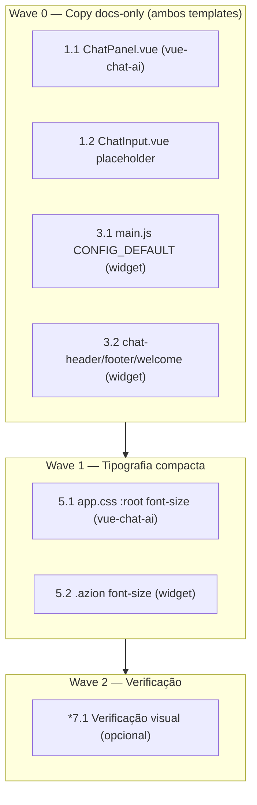

# Implementation Plan: Chat Docs-Only Narrative + Compact Typography

## Overview

Plano incremental para reescrever a narrativa dos templates de chat AI
da Azion (`vue-chat-ai` e `vue3-ai-chatbot-widget`) explicitando o escopo
docs-only e reduzir a escala tipográfica global. Cada fase é mergeável
independentemente: copy do `vue-chat-ai` (Fase 1), copy do widget
(Fase 2), tipografia compacta em ambos (Fase 3), verificação manual
(Fase 4).

Stack: Vue 3, Nuxt 3 (`vue-chat-ai`), Vite + PrimeVue (`vue3-ai-chatbot-widget`),
Tailwind + `@aziontech/webkit` + `@aziontech/theme` (`vue-chat-ai`),
`azion-theme` (widget). Toda implementação respeita os princípios em
`CLAUDE.md` e nas skills `code-craft-pragmatic`, `azion-design-system`.

### Mapeamento Properties → tipo de verificação

| Property | Verificação | Onde está | Fase |
|---|---|---|---|
| **P1** — Nenhuma nova ocorrência de `font-size` hardcoded (px puro) nos arquivos tocados | `grep -R "font-size:" templates/vue/vue-chat-ai/{components,assets} templates/vue/vue3-ai-chatbot-widget/src` inspecionado manualmente contra o diff | Fase 3 (após tipografia) | 3 |
| **P2** — Nenhuma classe Tailwind `text-xs/text-sm/text-base/text-lg` cru introduzida nos arquivos do `vue-chat-ai` (deve usar `text-body-*`/`text-heading-*` do webkit) | `grep -RnE "\\btext-(xs\|sm\|base\|lg\|xl)\\b" templates/vue/vue-chat-ai/components` sem novas ocorrências | Fase 1/3 | 3 |
| **P3** — Ambos templates renderizam a nova narrativa docs-only nos 3 pontos (header/welcome, empty state, placeholder) sem regressão visual | Verificação manual via `run` skill: rodar dev server, capturar screenshots dos empty states e chat aberto | Fase 4 | 4 |

> Tarefas marcadas com `*` são opcionais (testes/verificações). Tarefas
> sem `*` são obrigatórias para a feature ser dada como concluída.

---

## Tasks

### Fase 1 — Copy docs-only no `vue-chat-ai`

- [x] 1. Reescrever narrativa no chat principal Vue
  - [x] 1.1 Ajustar `ChatPanel.vue` — header, empty state, suggestions
    - Trocar `<h1>` "No que você está pensando hoje?" (linha ~149) por título docs-only ("Documentação Azion") + subtítulo curto ("Respondo dúvidas sobre a documentação da Azion.").
    - Substituir constante `SUGGESTIONS` (linhas 22–27) pelas 4 perguntas ancoradas em docs Azion (§7.1 do design): "Como criar uma Edge Application?", "Como escrever uma Edge Function?", "O que é o Azion WAF?", "Como configurar Cache Rules?".
    - Trocar rótulos "All Azion Platform" (linhas ~158 e ~323) por "Azion Docs".
    - Ajustar `providerLabel` no header do active state (linha ~239) para prefixar "Docs Assistant · ".
    - _Requirements: 1.1, 1.2, 1.4, 4.2_

  - [x] 1.2 Ajustar placeholder do `ChatInput.vue`
    - Substituir o placeholder default (linhas 155–161) por "Pergunte sobre a documentação da Azion…". Manter as variações `disabled` e `isLoading` mas alinhar tom (ex.: `disabled`: "Configure a chave de API em Settings para começar."; `isLoading`: "Gerando resposta…").
    - Preservar props/slots — apenas as strings mudam.
    - _Requirements: 1.3, 1.4, 1.5_

- [ ] 2. Checkpoint Fase 1
  - Copy do `vue-chat-ai` reflete escopo docs-only nos 3 pontos (header/empty, suggestions, placeholder).
  - `npm run dev` no template roda sem erro; empty state visível.
  - Ensure all tests pass, ask the user if questions arise.

---

### Fase 2 — Copy docs-only no `vue3-ai-chatbot-widget`

- [x] 3. Reescrever narrativa no widget de chatbot
  - [x] 3.1 Ajustar defaults em `src/main.js` (CONFIG_DEFAULT)
    - `title` default: `'Azion Docs Assistant'` (fallback para `document.title` e header).
    - `subTitle`: `'Answers based on Azion documentation'`.
    - `previewText`: `'Ask about Azion docs…'`.
    - `footerDisclaimer`: `'This assistant only answers questions about Azion documentation. Verify important information.'`.
    - `suggestionsOptions`: 4 entradas ancoradas em produtos Azion (Edge Application, Edge Function, WAF, Cache Rules) com `title` e `context` em EN.
    - Preservar env vars (`VITE_TITLE`, `VITE_SUBTITLE`, etc.) como override — só o fallback muda.
    - _Requirements: 1.1, 1.2, 1.3, 1.4, 1.5, 4.1, 4.2_

  - [x] 3.2 Ajustar fallbacks nos componentes do widget
    - `src/components/layout-chat/chat-header.vue:6` — fallback `'Copilot'` passa a `'Azion Docs Assistant'`.
    - `src/components/layout-chat/chat-footer.vue:70` — fallback do disclaimer menciona "Azion documentation".
    - `src/components/welcome.vue` — se tiver texto fixo default, alinhar ao mesmo tom docs-only.
    - _Requirements: 1.1, 1.2, 1.5_

- [ ] 4. Checkpoint Fase 2
  - Widget renderiza narrativa docs-only quando env vars não estão setadas.
  - `npm run dev` roda; header, welcome e footer refletem escopo.
  - Ensure all tests pass, ask the user if questions arise.

---

### Fase 3 — Escala tipográfica compacta

- [x] 5. Reduzir tipografia global via root font-size
  - [x] 5.1 Aplicar `font-size: 14px` no root do `vue-chat-ai`
    - Em `templates/vue/vue-chat-ai/assets/styles/app.css`: adicionar `:root { font-size: 14px }` (ou escopar a `#__nuxt` se validação em dev revelar regressão de spacing — decisão §7.2).
    - Não introduzir hard-coded `font-size` em componentes; nenhuma reescrita de `text-body-*`/`text-heading-*` em componentes.
    - **Property 1: nenhum novo `font-size:` hardcoded em `templates/vue/vue-chat-ai/{components,assets}` além dessa linha.**
    - **Validates: Requirements 2.1, 2.2, 2.3, 2.4, 2.5, 3.1, 3.3**

  - [x] 5.2 Aplicar `font-size: 14px` escopado ao widget
    - Em `templates/vue3-ai-chatbot-widget/src/assets/main.css` (ou arquivo equivalente já importado por `main.js`): adicionar `.azion { font-size: 14px }` (escopo do widget, não do host — decisão §7.3).
    - **Property 2: nenhuma classe Tailwind `text-{xs,sm,base,lg,xl}` cru introduzida no `vue-chat-ai`.** (grep no diff)
    - **Validates: Requirements 2.1, 2.2, 2.3, 2.5, 3.1, 3.2, 3.3**

- [ ] 6. Checkpoint Fase 3
  - Ambos templates renderizam com escala tipográfica reduzida sem inversão de hierarquia.
  - Nenhum spacing quebrado (checar dev server em ambos empty e active state).
  - Ensure all tests pass, ask the user if questions arise.

---

### Fase 4 — Verificação visual e limpeza

- [x]* 7.1 Verificação manual dos empty states e chat aberto
  - Rodar `npm run dev` no `vue-chat-ai` — abrir empty state, mandar mensagem, checar header/placeholder/suggestions.
  - Rodar `npm run dev` no `vue3-ai-chatbot-widget` — abrir widget, ver header/welcome/suggestions.
  - **Property 3: narrativa docs-only presente nos 3 pontos + escala menor visível em ambos.**
  - **Validates: Requirements 1.1, 1.2, 1.3, 1.4, 2.1**

---

## Notes

- Feature toca apenas UI/copy; sem backend, sem migração, sem flag.
- Copy do `vue-chat-ai` fica em PT-BR (alinhado ao existente); widget fica em EN.
- Nenhum requirement fica sem cobertura. `_Requirements:` presente em toda subtask.
- Se durante execução aparecer regressão de spacing por conta do
  `font-size: 14px` no `:root`, aplicar fallback do §7.2 do design
  (escopar ao wrapper `#__nuxt`).

---

## Task Dependency Graph

```json
{
  "waves": [
    { "id": 0, "tasks": ["1.1", "1.2", "3.1", "3.2"] },
    { "id": 1, "tasks": ["5.1", "5.2"] },
    { "id": 2, "tasks": ["7.1"] }
  ]
}
```

### Visualização (mermaid)



> **Notas sobre o grafo**
>
> - Wave 0: 4 tasks paralelas — arquivos distintos em templates distintos, zero conflito.
> - Wave 1: 2 tasks paralelas em arquivos CSS separados de cada template.
> - Wave 2: verificação manual opcional (`*`), pode ser pulada se as anteriores passaram.
> - Checkpoints (2, 4, 6) e epics (1, 3, 5) não aparecem no grafo.
